####  <font color="red"> 1，寄存器编程 控制GPIO </font>

##### 电路图
> 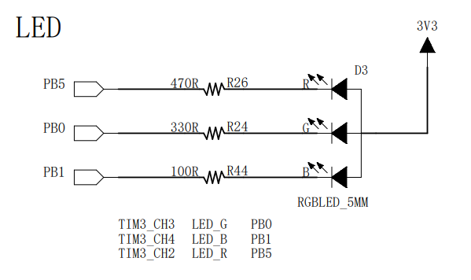

##### 挂载的时钟总线
> 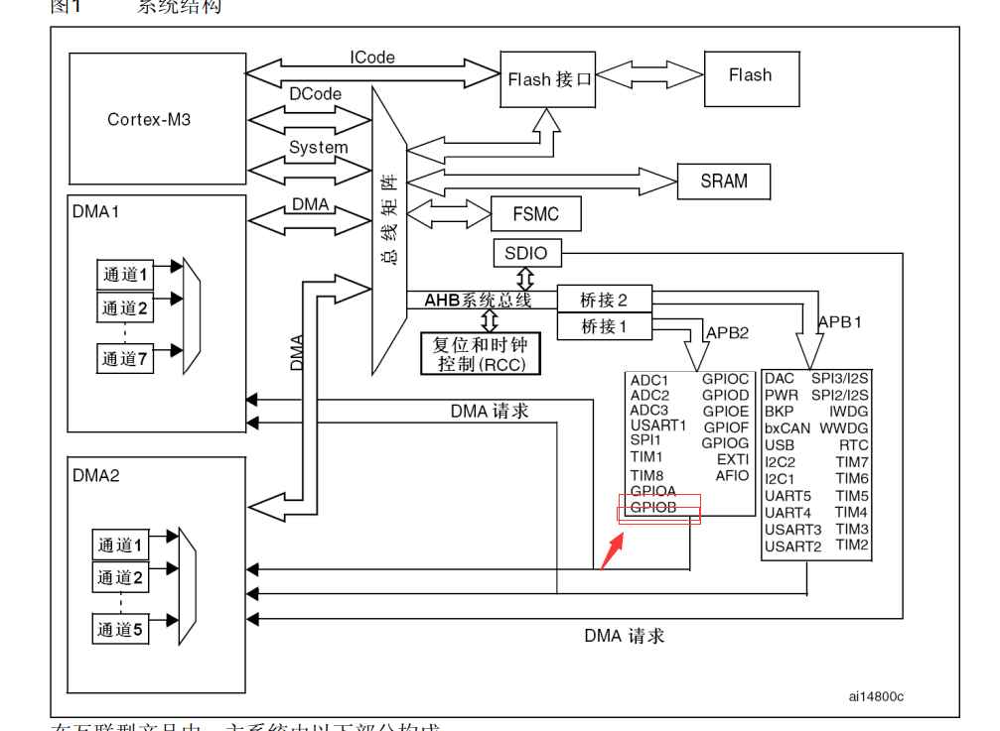

##### 挂载的时钟总线
###### 时钟总线基地址
> 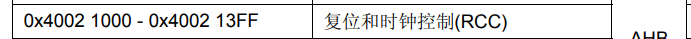
###### 时钟总线偏移地址
> 
###### 具体位
> 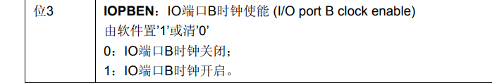

##### GPIOB配置
###### GPIOB 基地址
> 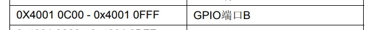
###### GPIO配置图表
> 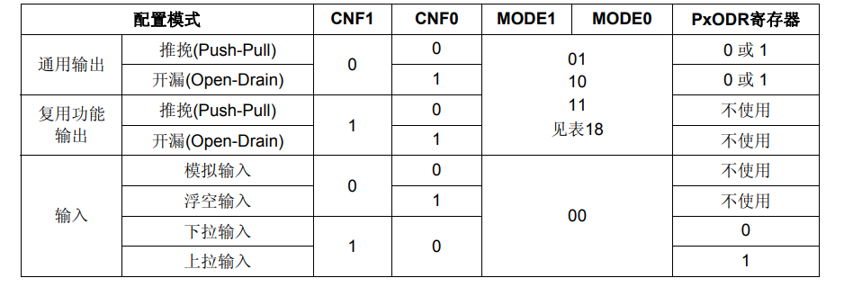

###### 配置GPIOB CRL寄存器
> 1, CRL寄存器偏移地址
> 
> 2, 功能配置
> 

##### 配置GPIO ODR寄存器
> 1, ODR 偏移地址
> 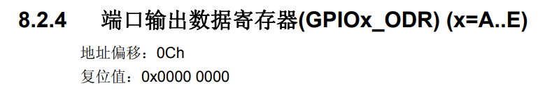
> 2, 功能配置
> 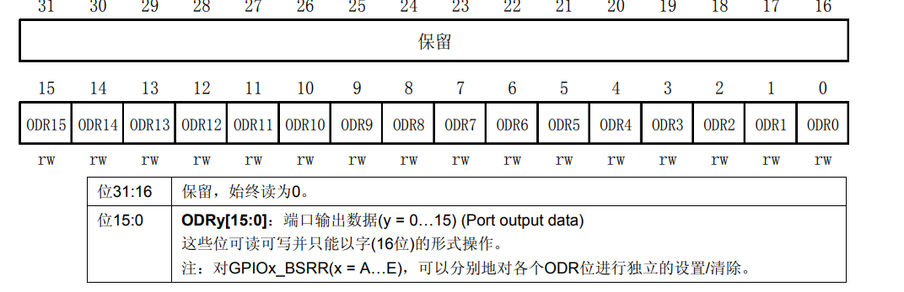

##### 具体代码
```C
#include <stdio.h>

/**
*	0x40021000 base address
* 	0x18 offset address
*/
#define CLK_APB2_ADDR 		(*(volatile unsigned int*)(0x40021000 + 0x18))

/**
*	0x40010C00 base address
* 	0x00 offset address
*/
#define GPIOB_CRL			(*(volatile unsigned int*)(0x40010C00 + 0x00))

/**
*	0x40010C00 base address
* 	0x0c offset address
*/
#define GPIOB_ODR			(*(volatile unsigned int*)(0x40010C00 + 0x0c))

#define LED_R		5
#define LED_G		0
#define LED_B		1

#define OPEN_R_LED	1
#define OPEN_G_LED 	1
#define OPEN_B_LED	1

int main(void){
	CLK_APB2_ADDR |= (0x01 << 3);   // enable GPIOB CLK

#if OPEN_R_LED
	GPIOB_CRL &= ~(0x0f << LED_R);   // clear
	GPIOB_CRL |= (0x11 << (4 * LED_R));		// speed 40Mhz
	GPIOB_ODR &= ~(0x01 << LED_R);
#endif
	
#if OPEN_G_LED
	GPIOB_CRL &= ~(0x0f << LED_G);   // clear
	GPIOB_CRL |= (0x11 << (4 * LED_G));		// speed 40Mhz
	GPIOB_ODR &= ~(0x01 << LED_G);
#endif

#if OPEN_B_LED
	GPIOB_CRL &= ~(0x0f << LED_B);   // clear
	GPIOB_CRL |= (0x11 << (4 * LED_B));		// speed 40Mhz
	GPIOB_ODR &= ~(0x01 << LED_B);
#endif
	
	while (1);
	
	return 0;
}

```

####  <font color="red"> 2, 使用CubeMX 配置stm32 hal库 </font>

##### 根据电路图将GPIOB0, GPIOB1, GPIOB5 配置成输出模式
> 1， 选择对应的引脚配置成输出即可
> 2， 然后在左侧System Core 里面的GPIO 中配置对应的GPIO选项
> 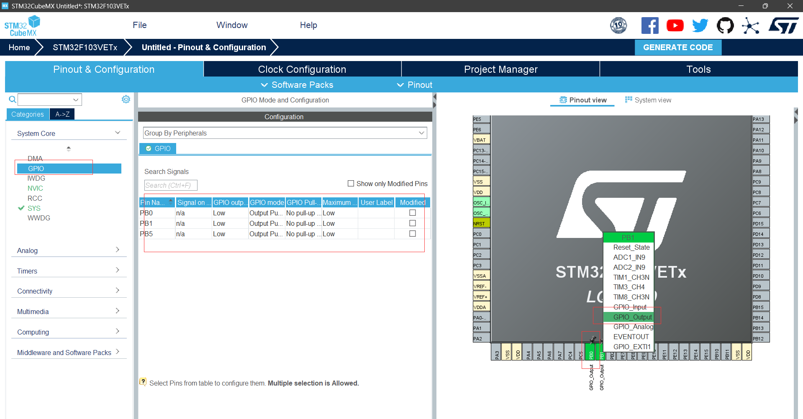

##### 配置debug选项， 
> 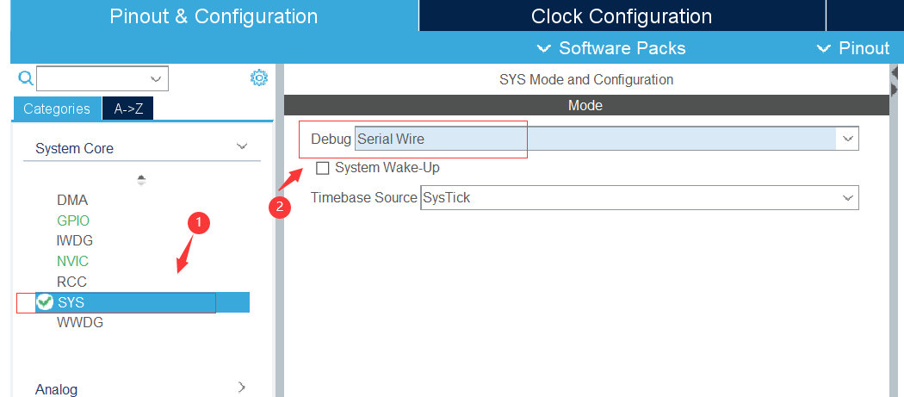

##### 配置Object 选项
> 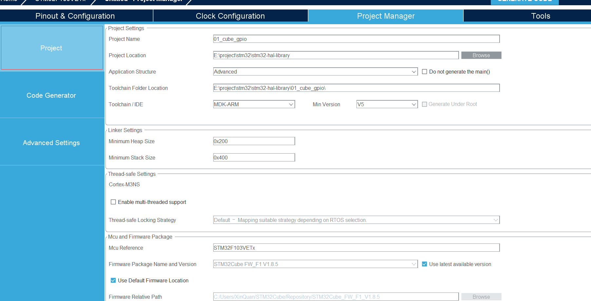

##### 配置 Code Generator
> 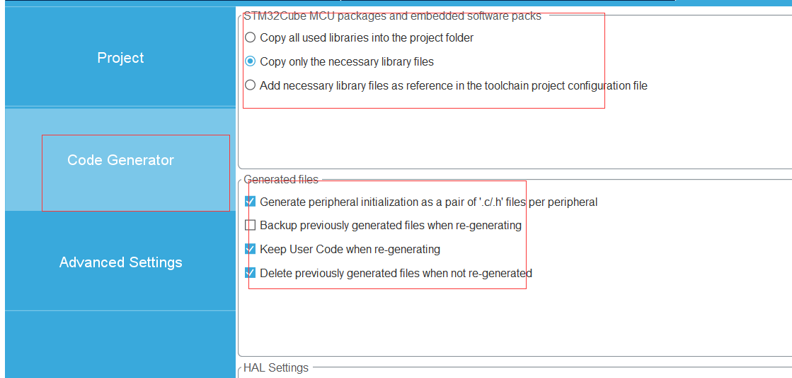

##### 生成 && 打开项目
> 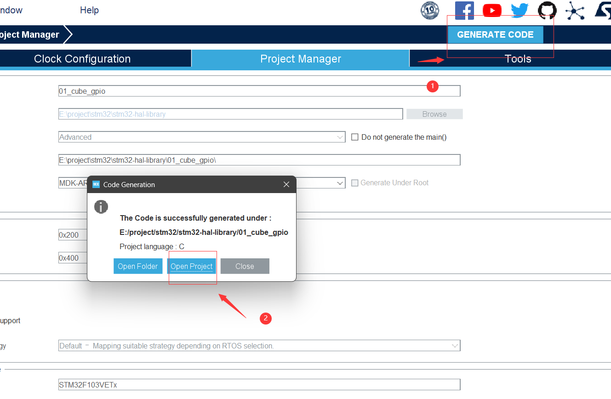

<br/>

####  <font color="red"> 3, 板级支持包 </font>

##### 板级支持包概述
> 起到承上启下的作用
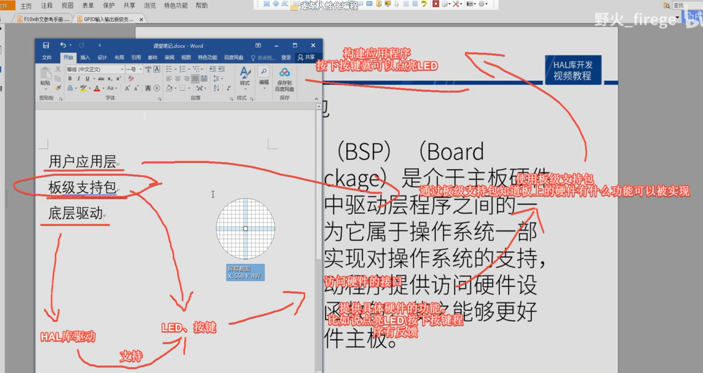

##### 1， LED 板级支持包构建
> bsp_led.c
```C
#include "bsp_led.h"

#include "stm32f1xx.h"
#include "stm32f1xx_hal_gpio.h"

void LED_Init(void){
	GPIO_InitTypeDef LED_INIT_STRUCT;
	
	__HAL_RCC_GPIOB_CLK_ENABLE();
	
	LED_INIT_STRUCT.Mode 	= GPIO_MODE_OUTPUT_PP;
	LED_INIT_STRUCT.Pin 	= LED_PIN;
	LED_INIT_STRUCT.Pull	= GPIO_NOPULL;
	LED_INIT_STRUCT.Speed	= GPIO_SPEED_FREQ_LOW;
	
	HAL_GPIO_Init(LED_PORT, &LED_INIT_STRUCT);
}
```

> bsp_led.h
```C
#ifndef __BSP_LED_H__
#define __BSP_LED_H__

#define LED_PORT 	GPIOB
#define LED_PIN		(GPIO_PIN_0 | GPIO_PIN_1 | GPIO_PIN_5)

#define LED_R_ON		do { HAL_GPIO_WritePin(LED_PORT, GPIO_PIN_5, GPIO_PIN_RESET); } while(0)
#define LED_R_OFF		do { HAL_GPIO_WritePin(LED_PORT, GPIO_PIN_5, GPIO_PIN_SET); } while(0)
#define LED_R_TOGGLE	do { HAL_GPIO_TogglePin(LED_PORT, GPIO_PIN_5); } while(0)

#define LED_G_ON		do { HAL_GPIO_WritePin(LED_PORT, GPIO_PIN_0, GPIO_PIN_RESET); } while(0)
#define LED_G_OFF		do { HAL_GPIO_WritePin(LED_PORT, GPIO_PIN_0, GPIO_PIN_SET); } while(0)
#define LED_G_TOGGLE	do { HAL_GPIO_TogglePin(LED_PORT, GPIO_PIN_0); } while(0)

#define LED_B_ON		do { HAL_GPIO_WritePin(LED_PORT, GPIO_PIN_1, GPIO_PIN_RESET); } while(0)
#define LED_B_OFF		do { HAL_GPIO_WritePin(LED_PORT, GPIO_PIN_1, GPIO_PIN_SET); } while(0)
#define LED_B_TOGGLE	do { HAL_GPIO_TogglePin(LED_PORT, GPIO_PIN_1); } while(0)

void LED_Init(void); 

#endif /* __BSP_LED_H__ */
```

> application.c
```C
#include "stm32f1xx.h"
#include "bsp_led.h"
#include "application.h"

static int cur_mode = 1;

void set_cur_mode(int mode){
	cur_mode = mode;
}

int get_cur_mode(void){
	return cur_mode;
}

void app_loop(void){
	int cnt = 1;
	LED_R_OFF;
	LED_G_OFF;
	LED_B_OFF;
	while (1){
		switch (cur_mode){
			case 1:{
				LED_R_ON;
				HAL_Delay(500);
				LED_R_OFF;
				HAL_Delay(500);
			}
			break;
			
			case 2:{
				LED_G_ON;
				HAL_Delay(500);
				LED_G_OFF;
				HAL_Delay(500);
			}
			break;
			
			case 3:{
				LED_B_ON;
				HAL_Delay(500);
				LED_B_OFF;
				HAL_Delay(500);
			}
			break;
			
			case 4:{
				LED_R_ON;
				HAL_Delay(500);
				LED_R_OFF;
				LED_G_ON;
				HAL_Delay(500);
				LED_G_OFF;
				LED_B_ON;
				HAL_Delay(500);
				LED_B_OFF;
			}
			break;

			default: {
				LED_R_OFF;
				LED_G_OFF;
				LED_B_OFF;
			}
			break;
		}
		
		if (++cnt == 10){
			cnt = 0;
			cur_mode = (cur_mode + 1) % 5 + 1;
		}
	}
}
```
> application.h
```C
#ifndef __APPLICATION_H__
#define __APPLICATION_H__

void app_loop(void);
int get_cur_mode(void);
void set_cur_mode(int);

#endif /* __APPLICATION_H__ */
```

> main 函数调用
> 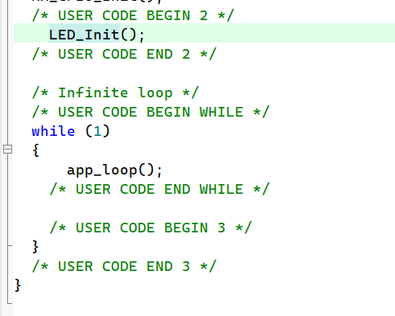

> 按键原理图
> 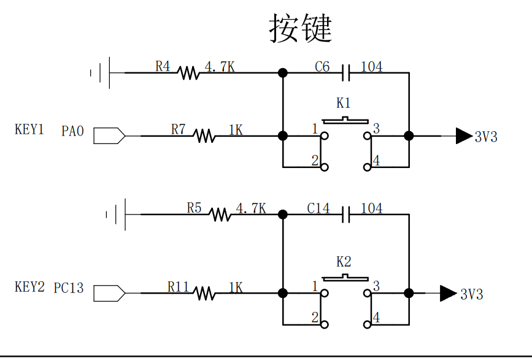

> bsp_key.c
```C
#include "bsp_key.h"
#include "stm32f1xx.h"
#include "stm32f1xx_hal_gpio.h"

void KEY_Init(void){
	GPIO_InitTypeDef KEY_INIT_STRUCT;
	
	__HAL_RCC_GPIOA_CLK_ENABLE();
	__HAL_RCC_GPIOC_CLK_ENABLE();
	
	KEY_INIT_STRUCT.Mode 	= GPIO_MODE_INPUT;
	KEY_INIT_STRUCT.Pin		= KEY1_PIN;
	KEY_INIT_STRUCT.Pull	= GPIO_PULLDOWN;
	KEY_INIT_STRUCT.Speed	= GPIO_SPEED_FREQ_HIGH;
	
	HAL_GPIO_Init(KEY1_PORT, &KEY_INIT_STRUCT);
	KEY_INIT_STRUCT.Pin 	= KEY2_PIN;
	HAL_GPIO_Init(KEY2_PORT, &KEY_INIT_STRUCT);
}

KEY_Status Scan_Key(GPIO_TypeDef* GPIOx, uint16_t GPIO_PIN_x){
	if (KEY_PRESS == HAL_GPIO_ReadPin(GPIOx, GPIO_PIN_x)){
		HAL_Delay(20);
		if (KEY_PRESS == HAL_GPIO_ReadPin(GPIOx, GPIO_PIN_x)){
			while (KEY_PRESS == HAL_GPIO_ReadPin(GPIOx, GPIO_PIN_x));
			return KEY_PRESS;
		}
	}
	
	return KEY_RELEASE;
}
```

> bsp_led.h
```C
#ifndef __BSP_KEY_H__
#define __BSP_KEY_H__

#include "stm32f1xx.h"

#define KEY1_PORT 	GPIOA
#define KEY1_PIN	GPIO_PIN_0

#define KEY2_PORT 	GPIOC
#define KEY2_PIN 	GPIO_PIN_13

#define SCAN_KEY1	Scan_Key(KEY1_PORT, KEY1_PIN)
#define SCAN_KEY2	Scan_Key(KEY2_PORT, KEY2_PIN)

typedef enum{
	KEY_RELEASE = 0U,
	KEY_PRESS,
}KEY_Status;


void KEY_Init(void);
KEY_Status Scan_Key(GPIO_TypeDef*, uint16_t);

#endif /* __BSP_KEY_H__ */
```

> 使用key控制app中的模式
```C
if (KEY_PRESS == SCAN_KEY1){
	if (++cur_mode == 5)
		cur_mode = 1;
	close_all_led();
	continue;
}
if (KEY_PRESS == SCAN_KEY2){
	if (--cur_mode == 0)
		cur_mode = 4;
	close_all_led();
	continue;
}
```

> 最后main函数记得初始化key
> 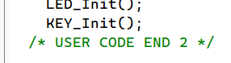
