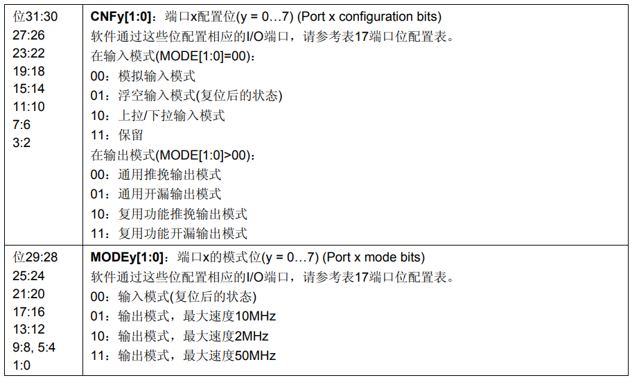

####  <font color="red"> 1，寄存器编程 控制GPIO </font>

##### 电路图
> 

##### 挂载的时钟总线
> 

##### 挂载的时钟总线
###### 时钟总线基地址
> 
###### 时钟总线偏移地址
> 
###### 具体位
> 

##### GPIOB配置
###### GPIOB 基地址
> 
###### GPIO配置图表
> 

###### 配置GPIOB CRL寄存器
> 1, CRL寄存器偏移地址
> 
> 2, 功能配置
> 

##### 配置GPIO ODR寄存器
> 1, ODR 偏移地址
> 
> 2, 功能配置
> 

##### 具体代码
```C
#include <stdio.h>

/**
*	0x40021000 base address
* 	0x18 offset address
*/
#define CLK_APB2_ADDR 		(*(volatile unsigned int*)(0x40021000 + 0x18))

/**
*	0x40010C00 base address
* 	0x00 offset address
*/
#define GPIOB_CRL			(*(volatile unsigned int*)(0x40010C00 + 0x00))

/**
*	0x40010C00 base address
* 	0x0c offset address
*/
#define GPIOB_ODR			(*(volatile unsigned int*)(0x40010C00 + 0x0c))

#define LED_R		5
#define LED_G		0
#define LED_B		1

#define OPEN_R_LED	1
#define OPEN_G_LED 	1
#define OPEN_B_LED	1

int main(void){
	CLK_APB2_ADDR |= (0x01 << 3);   // enable GPIOB CLK

#if OPEN_R_LED
	GPIOB_CRL &= ~(0x0f << LED_R);   // clear
	GPIOB_CRL |= (0x11 << (4 * LED_R));		// speed 40Mhz
	GPIOB_ODR &= ~(0x01 << LED_R);
#endif
	
#if OPEN_G_LED
	GPIOB_CRL &= ~(0x0f << LED_G);   // clear
	GPIOB_CRL |= (0x11 << (4 * LED_G));		// speed 40Mhz
	GPIOB_ODR &= ~(0x01 << LED_G);
#endif

#if OPEN_B_LED
	GPIOB_CRL &= ~(0x0f << LED_B);   // clear
	GPIOB_CRL |= (0x11 << (4 * LED_B));		// speed 40Mhz
	GPIOB_ODR &= ~(0x01 << LED_B);
#endif
	
	while (1);
	
	return 0;
}

```
