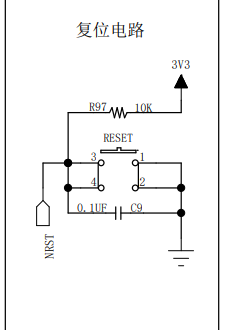

####  <font color="red"> 1，寄存器编程 控制GPIO </font>

##### 电路图
> 

##### 挂载的时钟总线
> 

##### 挂载的时钟总线
###### 时钟总线基地址
> 
###### 时钟总线偏移地址
> 
###### 具体位
> 

##### GPIOB配置
###### GPIOB 基地址
> 
###### GPIO配置图表
> 

###### 配置GPIOB CRL寄存器
> 1, CRL寄存器偏移地址
> 
> 2, 功能配置
> 

##### 配置GPIO ODR寄存器
> 1, ODR 偏移地址
> 
> 2, 功能配置
> 

##### 具体代码
```C
#include <stdio.h>

/**
*	0x40021000 base address
* 	0x18 offset address
*/
#define CLK_APB2_ADDR 		(*(volatile unsigned int*)(0x40021000 + 0x18))

/**
*	0x40010C00 base address
* 	0x00 offset address
*/
#define GPIOB_CRL			(*(volatile unsigned int*)(0x40010C00 + 0x00))

/**
*	0x40010C00 base address
* 	0x0c offset address
*/
#define GPIOB_ODR			(*(volatile unsigned int*)(0x40010C00 + 0x0c))

#define LED_R		5
#define LED_G		0
#define LED_B		1

#define OPEN_R_LED	1
#define OPEN_G_LED 	1
#define OPEN_B_LED	1

int main(void){
	CLK_APB2_ADDR |= (0x01 << 3);   // enable GPIOB CLK

#if OPEN_R_LED
	GPIOB_CRL &= ~(0x0f << LED_R);   // clear
	GPIOB_CRL |= (0x11 << (4 * LED_R));		// speed 40Mhz
	GPIOB_ODR &= ~(0x01 << LED_R);
#endif
	
#if OPEN_G_LED
	GPIOB_CRL &= ~(0x0f << LED_G);   // clear
	GPIOB_CRL |= (0x11 << (4 * LED_G));		// speed 40Mhz
	GPIOB_ODR &= ~(0x01 << LED_G);
#endif

#if OPEN_B_LED
	GPIOB_CRL &= ~(0x0f << LED_B);   // clear
	GPIOB_CRL |= (0x11 << (4 * LED_B));		// speed 40Mhz
	GPIOB_ODR &= ~(0x01 << LED_B);
#endif
	
	while (1);
	
	return 0;
}

```

####  <font color="red"> 2, 使用CubeMX 配置stm32 hal库 </font>

##### 根据电路图将GPIOB0, GPIOB1, GPIOB5 配置成输出模式
> 1， 选择对应的引脚配置成输出即可
> 2， 然后在左侧System Core 里面的GPIO 中配置对应的GPIO选项
> 

##### 配置debug选项， 
> 

##### 配置Object 选项
> 

##### 配置 Code Generator
> 

##### 生成 && 打开项目
> 

<br/>

####  <font color="red"> 3, 板级支持包 </font>

##### 板级支持包概述
> 起到承上启下的作用


##### 1， LED 板级支持包构建
> bsp_led.c
```C
#include "bsp_led.h"

#include "stm32f1xx.h"
#include "stm32f1xx_hal_gpio.h"

void LED_Init(void){
	GPIO_InitTypeDef LED_INIT_STRUCT;
	
	__HAL_RCC_GPIOB_CLK_ENABLE();
	
	LED_INIT_STRUCT.Mode 	= GPIO_MODE_OUTPUT_PP;
	LED_INIT_STRUCT.Pin 	= LED_PIN;
	LED_INIT_STRUCT.Pull	= GPIO_NOPULL;
	LED_INIT_STRUCT.Speed	= GPIO_SPEED_FREQ_LOW;
	
	HAL_GPIO_Init(LED_PORT, &LED_INIT_STRUCT);
}
```

> bsp_led.h
```C
#ifndef __BSP_LED_H__
#define __BSP_LED_H__

#define LED_PORT 	GPIOB
#define LED_PIN		(GPIO_PIN_0 | GPIO_PIN_1 | GPIO_PIN_5)

#define LED_R_ON		do { HAL_GPIO_WritePin(LED_PORT, GPIO_PIN_5, GPIO_PIN_RESET); } while(0)
#define LED_R_OFF		do { HAL_GPIO_WritePin(LED_PORT, GPIO_PIN_5, GPIO_PIN_SET); } while(0)
#define LED_R_TOGGLE	do { HAL_GPIO_TogglePin(LED_PORT, GPIO_PIN_5); } while(0)

#define LED_G_ON		do { HAL_GPIO_WritePin(LED_PORT, GPIO_PIN_0, GPIO_PIN_RESET); } while(0)
#define LED_G_OFF		do { HAL_GPIO_WritePin(LED_PORT, GPIO_PIN_0, GPIO_PIN_SET); } while(0)
#define LED_G_TOGGLE	do { HAL_GPIO_TogglePin(LED_PORT, GPIO_PIN_0); } while(0)

#define LED_B_ON		do { HAL_GPIO_WritePin(LED_PORT, GPIO_PIN_1, GPIO_PIN_RESET); } while(0)
#define LED_B_OFF		do { HAL_GPIO_WritePin(LED_PORT, GPIO_PIN_1, GPIO_PIN_SET); } while(0)
#define LED_B_TOGGLE	do { HAL_GPIO_TogglePin(LED_PORT, GPIO_PIN_1); } while(0)

void LED_Init(void); 

#endif /* __BSP_LED_H__ */
```

> application.c
```C
#include "stm32f1xx.h"
#include "bsp_led.h"
#include "application.h"

static int cur_mode = 1;

void set_cur_mode(int mode){
	cur_mode = mode;
}

int get_cur_mode(void){
	return cur_mode;
}

void app_loop(void){
	int cnt = 1;
	LED_R_OFF;
	LED_G_OFF;
	LED_B_OFF;
	while (1){
		switch (cur_mode){
			case 1:{
				LED_R_ON;
				HAL_Delay(500);
				LED_R_OFF;
				HAL_Delay(500);
			}
			break;
			
			case 2:{
				LED_G_ON;
				HAL_Delay(500);
				LED_G_OFF;
				HAL_Delay(500);
			}
			break;
			
			case 3:{
				LED_B_ON;
				HAL_Delay(500);
				LED_B_OFF;
				HAL_Delay(500);
			}
			break;
			
			case 4:{
				LED_R_ON;
				HAL_Delay(500);
				LED_R_OFF;
				LED_G_ON;
				HAL_Delay(500);
				LED_G_OFF;
				LED_B_ON;
				HAL_Delay(500);
				LED_B_OFF;
			}
			break;

			default: {
				LED_R_OFF;
				LED_G_OFF;
				LED_B_OFF;
			}
			break;
		}
		
		if (++cnt == 10){
			cnt = 0;
			cur_mode = (cur_mode + 1) % 5 + 1;
		}
	}
}
```
> application.h
```C
#ifndef __APPLICATION_H__
#define __APPLICATION_H__

void app_loop(void);
int get_cur_mode(void);
void set_cur_mode(int);

#endif /* __APPLICATION_H__ */
```

> main 函数调用
> 

> 按键原理图
> 

> bsp_key.c
```C
#include "bsp_key.h"
#include "stm32f1xx.h"
#include "stm32f1xx_hal_gpio.h"

void KEY_Init(void){
	GPIO_InitTypeDef KEY_INIT_STRUCT;
	
	__HAL_RCC_GPIOA_CLK_ENABLE();
	__HAL_RCC_GPIOC_CLK_ENABLE();
	
	KEY_INIT_STRUCT.Mode 	= GPIO_MODE_INPUT;
	KEY_INIT_STRUCT.Pin		= KEY1_PIN;
	KEY_INIT_STRUCT.Pull	= GPIO_PULLDOWN;
	KEY_INIT_STRUCT.Speed	= GPIO_SPEED_FREQ_HIGH;
	
	HAL_GPIO_Init(KEY1_PORT, &KEY_INIT_STRUCT);
	KEY_INIT_STRUCT.Pin 	= KEY2_PIN;
	HAL_GPIO_Init(KEY2_PORT, &KEY_INIT_STRUCT);
}

KEY_Status Scan_Key(GPIO_TypeDef* GPIOx, uint16_t GPIO_PIN_x){
	if (KEY_PRESS == HAL_GPIO_ReadPin(GPIOx, GPIO_PIN_x)){
		HAL_Delay(20);
		if (KEY_PRESS == HAL_GPIO_ReadPin(GPIOx, GPIO_PIN_x)){
			while (KEY_PRESS == HAL_GPIO_ReadPin(GPIOx, GPIO_PIN_x));
			return KEY_PRESS;
		}
	}
	
	return KEY_RELEASE;
}
```

> bsp_led.h
```C
#ifndef __BSP_KEY_H__
#define __BSP_KEY_H__

#include "stm32f1xx.h"

#define KEY1_PORT 	GPIOA
#define KEY1_PIN	GPIO_PIN_0

#define KEY2_PORT 	GPIOC
#define KEY2_PIN 	GPIO_PIN_13

#define SCAN_KEY1	Scan_Key(KEY1_PORT, KEY1_PIN)
#define SCAN_KEY2	Scan_Key(KEY2_PORT, KEY2_PIN)

typedef enum{
	KEY_RELEASE = 0U,
	KEY_PRESS,
}KEY_Status;


void KEY_Init(void);
KEY_Status Scan_Key(GPIO_TypeDef*, uint16_t);

#endif /* __BSP_KEY_H__ */
```

> 使用key控制app中的模式
```C
if (KEY_PRESS == SCAN_KEY1){
	if (++cur_mode == 5)
		cur_mode = 1;
	close_all_led();
	continue;
}
if (KEY_PRESS == SCAN_KEY2){
	if (--cur_mode == 0)
		cur_mode = 4;
	close_all_led();
	continue;
}
```

> 最后main函数记得初始化key
> 

<br/>

####  <font color="red"> 4, STM32启动流程 </font>

> 1， 芯片上电以后会触发复位异常

> 2， 触发复位异常后会跳转到终端向量表中寻找复位异常

> 3, 找到复位异常的位置， 根据指令做相应的操作

##### 大概流程
触发异常--》 中断向量表 --》 用户程序

> 启动会具体中断向量表位置根据Boot0 和 Boot1来选择
> 

> 映射方式
> 

> 启动文件流程
> 
> * 1， 设置堆栈指针
> * 2， 设置PC指针的值
> * 3， 设置中断向量表
> * 4， 配置系统时钟
> * 5， 调用__main 初始化堆栈的工作， 最终跳转到自己写的main函数

> 1 初始化堆栈指针
>  

> 2 上电异常
> 

> 3 上电异常处理 (跳转到main函数 和 执行系统时钟初始化)
> 

> 以下中断触发时也会掉中断向量表中的函数
> 


####  <font color="red"> 5 RCC 复位和时钟控制 </font>

##### STM32复位功能
> 

> 1, 系统复位
> 

> 电路中的复位
> 

##### STM32 时钟选择
> 由晶振产生的高速外部时钟
> 

> 根据cubeMX 自动生成的时钟树
> 
> 对于STM32上的时钟， 具体怎么配置， 根据需求决定， 时钟频率越高功耗也会越高

> 根据时钟树配置出来的具体代码如下
```C
void SystemClock_Config(void)
{
  RCC_OscInitTypeDef RCC_OscInitStruct = {0};
  RCC_ClkInitTypeDef RCC_ClkInitStruct = {0};

  /** Initializes the RCC Oscillators according to the specified parameters
  * in the RCC_OscInitTypeDef structure.
  */
  RCC_OscInitStruct.OscillatorType = RCC_OSCILLATORTYPE_HSE;
  RCC_OscInitStruct.HSEState = RCC_HSE_ON;
  RCC_OscInitStruct.HSEPredivValue = RCC_HSE_PREDIV_DIV1;
  RCC_OscInitStruct.HSIState = RCC_HSI_ON;
  RCC_OscInitStruct.PLL.PLLState = RCC_PLL_ON;
  RCC_OscInitStruct.PLL.PLLSource = RCC_PLLSOURCE_HSE;
  RCC_OscInitStruct.PLL.PLLMUL = RCC_PLL_MUL9;
  if (HAL_RCC_OscConfig(&RCC_OscInitStruct) != HAL_OK)
  {
    Error_Handler();
  }

  /** Initializes the CPU, AHB and APB buses clocks
  */
  RCC_ClkInitStruct.ClockType = RCC_CLOCKTYPE_HCLK|RCC_CLOCKTYPE_SYSCLK
                              |RCC_CLOCKTYPE_PCLK1|RCC_CLOCKTYPE_PCLK2;
  RCC_ClkInitStruct.SYSCLKSource = RCC_SYSCLKSOURCE_PLLCLK;
  RCC_ClkInitStruct.AHBCLKDivider = RCC_SYSCLK_DIV1;
  RCC_ClkInitStruct.APB1CLKDivider = RCC_HCLK_DIV2;
  RCC_ClkInitStruct.APB2CLKDivider = RCC_HCLK_DIV1;

  if (HAL_RCC_ClockConfig(&RCC_ClkInitStruct, FLASH_LATENCY_2) != HAL_OK)
  {
    Error_Handler();
  }
}
```

####  <font color="red"> 6 中断 </font>
##### 1 什么是中断


##### 2 抢占优先级组和子优先组


##### 3 NVIC库函数


##### 4 cubeMX 配置
> 1, 
> 
> 2, 
> 
> 3, 
> 
> 4, 生成的代码
```C
void MX_GPIO_Init(void)
{

  GPIO_InitTypeDef GPIO_InitStruct = {0};

  /* GPIO Ports Clock Enable */
  __HAL_RCC_GPIOC_CLK_ENABLE();
  __HAL_RCC_GPIOA_CLK_ENABLE();

  /*Configure GPIO pin : PC13 */
  GPIO_InitStruct.Pin = GPIO_PIN_13;
  GPIO_InitStruct.Mode = GPIO_MODE_IT_RISING;
  GPIO_InitStruct.Pull = GPIO_NOPULL;
  HAL_GPIO_Init(GPIOC, &GPIO_InitStruct);

  /* EXTI interrupt init*/
  HAL_NVIC_SetPriority(EXTI15_10_IRQn, 1, 0);
  HAL_NVIC_EnableIRQ(EXTI15_10_IRQn);

}
```
##### bsp包
> bsp_exit.h
```C
#ifndef __BSP_EXIT_H__
#define __BSP_EXIT_H__

#define KEY1_EXIT_PORT		GPIOA
#define KEY1_EXIT_PIN		GPIO_PIN_0
#define KEY1_EXIT_MODE		GPIO_MODE_IT_RISING
#define KEY1_EXIT_IRQ		EXTI0_IRQn
#define KEY1_EXIT_PULL		GPIO_NOPULL

#define KEY2_EXIT_PORT		GPIOC
#define KEY2_EXIT_PIN		GPIO_PIN_13
#define KEY2_EXIT_MODE		GPIO_MODE_IT_RISING
#define KEY2_EXIT_IRQ		EXTI15_10_IRQn
#define KEY2_EXIT_PULL		GPIO_NOPULL


void KEY1_EXIT_INIT(void);
void KEY2_EXIT_INIT(void);

#endif /* __BSP_EXIT_H__ */
```

> bsp_exit.h
```C
#include "stm32f1xx.h"
#include "bsp_exit.h"

void KEY1_EXIT_INIT(void){
	__HAL_RCC_GPIOA_CLK_ENABLE();
	
	GPIO_InitTypeDef EXIT_Struct = {0};
	EXIT_Struct.Pin 	= KEY1_EXIT_PIN;
	EXIT_Struct.Mode 	= KEY1_EXIT_MODE;
	EXIT_Struct.Pull	= KEY1_EXIT_PULL;
	
	HAL_GPIO_Init(KEY1_EXIT_PORT, &EXIT_Struct);
	
	HAL_NVIC_SetPriority(KEY1_EXIT_IRQ, 1, 0);
	HAL_NVIC_EnableIRQ(KEY1_EXIT_IRQ);
}

void KEY2_EXIT_INIT(void){
	__HAL_RCC_GPIOC_CLK_ENABLE();
	
	GPIO_InitTypeDef EXIT_Struct = {0};
	EXIT_Struct.Pin 	= KEY2_EXIT_PIN;
	EXIT_Struct.Mode 	= KEY2_EXIT_MODE;
	EXIT_Struct.Pull	= KEY2_EXIT_PULL;
	
	HAL_GPIO_Init(KEY2_EXIT_PORT, &EXIT_Struct);
	
	HAL_NVIC_SetPriority(KEY2_EXIT_IRQ, 1, 0);
	HAL_NVIC_EnableIRQ(KEY2_EXIT_IRQ);
}
```

> 编写回调函数
```C
void EXTI0_IRQHandler(void){
	if (__HAL_GPIO_EXTI_GET_IT(KEY1_EXIT_PIN) != GPIO_PIN_RESET){
		LED_B_TOGGLE;
		__HAL_GPIO_EXTI_CLEAR_IT(KEY1_EXIT_PIN);
	}
}

void EXTI15_10_IRQHandler(void){
	if (__HAL_GPIO_EXTI_GET_IT(KEY2_EXIT_PIN) != GPIO_PIN_RESET){
		LED_G_TOGGLE;
		__HAL_GPIO_EXTI_CLEAR_IT(KEY2_EXIT_PIN);
	}
}
```

####  <font color="red"> 7 SysTick 定时器 </font>

##### 1， cubeMX 配置
> 时基配置 （根据需求配置， 一般SysTick即可）
> 
> 具体频率为
> 

> bsp_systick.h
``` C
#ifndef __BSP_SYSTICK_H__
#define __BSP_SYSTICK_H__

void sysTick_Init(void);
void decrease_current_time(void);
void delay_ms(unsigned int);
void delay_us(unsigned int);

#endif /* __BSP_SYSTICK_H__ */
```

> bsp_systick.c
```C
#include "bsp_systick.h"
#include "stm32f1xx.h"

static volatile unsigned long CurDelayTime = 0;

void sysTick_Init(void){
	while(HAL_SYSTICK_Config(SystemCoreClock / 1000000));  // per 1us a interrupt
}

void decrease_current_time(void){
	if(CurDelayTime)
		--CurDelayTime;
}

void delay_ms(unsigned int t){
	CurDelayTime = t * 1000;
	while (CurDelayTime);
}

void delay_us(unsigned int t){
	CurDelayTime = t;
	while (CurDelayTime);
}
```

> 在系统滴答定时器中断中添加代码
```C
void SysTick_Handler(void)
{
  /* USER CODE BEGIN SysTick_IRQn 0 */

  /* USER CODE END SysTick_IRQn 0 */
  	HAL_IncTick();   //原来就有的
  /* USER CODE BEGIN SysTick_IRQn 1 */
	decrease_current_time();		// per 1 interrupt decrease CurDelayTime 1
  /* USER CODE END SysTick_IRQn 1 */
}
```

> 主函数的使用
```C
int main(void)
{
	HAL_Init();
	SystemClock_Config();
	MX_GPIO_Init();

	LED_Init();		//灯初始化
	sysTick_Init(); // 设置重载值

  while (1)
  {
	  
	  delay_ms(1000);
	  LED_B_OFF;
	  delay_ms(1000);
	  LED_R_OFF;
	  delay_ms(1000);
	  LED_G_OFF;
	  
	  delay_ms(1000);
	  LED_B_ON;
	  delay_ms(1000);
	  LED_R_ON;
	  delay_ms(1000);
	  LED_G_ON;
  }
}
```

####  <font color="red"> 8 debug的使用 </font>
> 环境配置
> 
> 

####  <font color="red"> 9 usart </font>
##### 1, 协议层
> 传输数据
> 

> 组成框图
> 

##### 2， 初始化流程


##### 3, 代码
**普通中断接收代码**

> bsp_uart.h
```C
#ifndef __BSP_UART_H__
#define __BSP_UART_H__

#include <stdio.h>
#include "stm32f1xx.h"

#define UART_INSTANCE		USART1
#define UART_BAUD			115200

#define UART_CLK_ENABLE()		__HAL_RCC_USART1_CLK_ENABLE()
#define UART_TX_CLK_ENABLE()	__HAL_RCC_GPIOA_CLK_ENABLE()
#define UART_RX_CLK_ENABLE()	__HAL_RCC_GPIOA_CLK_ENABLE()

#define UART_TX_PIN			GPIO_PIN_9
#define UART_RX_PIN			GPIO_PIN_10

#define UART_TX_PORT		GPIOA
#define UART_RX_PORT		GPIOA

#define UART_IQR			USART1_IRQn


void UART_Init(void);
void UART_SendStr(unsigned char *);
int fputc(int ch, FILE *f);
int fgetc(FILE *f);

#endif /* __BSP_UART_H__ */
```

> bsp_uart.c
```C
#include "stm32f1xx.h"
#include "bsp_uart.h"
#include <string.h>
#include <stdio.h>
#include "bsp_led.h"

UART_HandleTypeDef UART_Handle;

void UART_Init(void){
	UART_Handle.Instance		= UART_INSTANCE;
	
	UART_Handle.Init.BaudRate 	= UART_BAUD;
	UART_Handle.Init.WordLength = UART_WORDLENGTH_8B;
	UART_Handle.Init.Parity		= UART_PARITY_NONE;
	UART_Handle.Init.StopBits	= UART_STOPBITS_1;
	UART_Handle.Init.Mode		= UART_MODE_TX_RX;
	UART_Handle.Init.HwFlowCtl	= UART_HWCONTROL_NONE;
	
	HAL_UART_Init(&UART_Handle);
	__HAL_UART_ENABLE_IT(&UART_Handle, UART_IT_RXNE);
}

void HAL_UART_MspInit(UART_HandleTypeDef* uartHandle){
	GPIO_InitTypeDef GPIO_InitStruct = {0};
	if (uartHandle->Instance == UART_INSTANCE){
		// enable clock
		UART_CLK_ENABLE();
		UART_TX_CLK_ENABLE();
		UART_RX_CLK_ENABLE();
		
		// init gpio
		GPIO_InitStruct.Pin 	= UART_TX_PIN;
		GPIO_InitStruct.Mode 	= GPIO_MODE_AF_PP;
		GPIO_InitStruct.Speed 	= GPIO_SPEED_FREQ_HIGH;
		GPIO_InitStruct.Pull	= GPIO_PULLUP;
		HAL_GPIO_Init(UART_TX_PORT, &GPIO_InitStruct);
		
		GPIO_InitStruct.Pin		= UART_RX_PIN;
		GPIO_InitStruct.Mode	= GPIO_MODE_AF_INPUT;
		HAL_GPIO_Init(UART_RX_PORT, &GPIO_InitStruct);
		
		HAL_NVIC_SetPriority(UART_IQR, 0, 0);
		HAL_NVIC_EnableIRQ(UART_IQR);
	}

}


void UART_SendStr(unsigned char *str){
	int i = 0;
	do{
		HAL_UART_Transmit(&UART_Handle, (unsigned char*)(str + i), 1, 1000);
	}while(*(str + i++) != '\0');
}

int fputc(int ch, FILE *f){
	HAL_UART_Transmit(&UART_Handle, (unsigned char*)&ch, 1, 1000);
	return (ch);
}

int fgetc(FILE *f){
	int ch;
	HAL_UART_Receive(&UART_Handle, (unsigned char*)&ch ,1, 1000);
	return (ch);
}
```

> 中断函数代码
```C
void USART1_IRQHandler(void)
{
	char c;
	if (__HAL_UART_GET_FLAG(&UART_Handle, UART_FLAG_RXNE) == SET){
		HAL_UART_Receive(&UART_Handle, (unsigned char*)&c, 1, 1000);
		HAL_UART_Transmit(&UART_Handle, (unsigned char*)&c, 1, 1000);
		__HAL_UART_CLEAR_FLAG(&UART_Handle, UART_FLAG_RXNE);
	}
}
```
**空闲中断代码**
> bsp_uart.c
```C
#include "stm32f1xx.h"
#include "bsp_uart.h"
#include <string.h>
#include <stdio.h>
#include "bsp_led.h"

UART_HandleTypeDef 	UART_Handle;
DMA_HandleTypeDef	UART_DMA_Handle;

static uartRecvData recv_info = {0};

uint8_t *get_uart_recv_data(void){
	return recv_info.data;
}

uint8_t get_uart_recv_len(void){
	return recv_info.data_len;
}

void handle_rece_info(void){
	HAL_UART_DMAStop(&UART_Handle);
	recv_info.data_len = BUFFER_LEN - __HAL_DMA_GET_COUNTER(&UART_DMA_Handle);
	recv_info.data[recv_info.data_len] = '\0';
	printf("recv data length: %d, info: %s\r\n", get_uart_recv_len(), get_uart_recv_data());
	HAL_UART_Receive_DMA(&UART_Handle, get_uart_recv_data(), BUFFER_LEN);
}

void UART_Init(void){
	UART_Handle.Instance		= UART_INSTANCE;
	
	// init uart
	UART_Handle.Init.BaudRate 	= UART_BAUD;
	UART_Handle.Init.WordLength = UART_WORDLENGTH_8B;
	UART_Handle.Init.Parity		= UART_PARITY_NONE;
	UART_Handle.Init.StopBits	= UART_STOPBITS_1;
	UART_Handle.Init.Mode		= UART_MODE_TX_RX;
	UART_Handle.Init.HwFlowCtl	= UART_HWCONTROL_NONE;
	
	HAL_UART_Init(&UART_Handle);
	// __HAL_UART_ENABLE_IT(&UART_Handle, UART_IT_RXNE);
	__HAL_UART_ENABLE_IT(&UART_Handle, UART_IT_IDLE); //open idle interrupt
	HAL_UART_Receive_DMA(&UART_Handle, recv_info.data, BUFFER_LEN);	// open dma receive
}

void HAL_UART_MspInit(UART_HandleTypeDef* uartHandle){
	GPIO_InitTypeDef GPIO_InitStruct = {0};
	if (uartHandle->Instance == UART_INSTANCE){
		// enable clock
		UART_CLK_ENABLE();
		UART_TX_CLK_ENABLE();
		UART_RX_CLK_ENABLE();
		UART_DMA_CLK_ENABLE();
		
		// init gpio
		GPIO_InitStruct.Pin 	= UART_TX_PIN;
		GPIO_InitStruct.Mode 	= GPIO_MODE_AF_PP;
		GPIO_InitStruct.Speed 	= GPIO_SPEED_FREQ_HIGH;
		GPIO_InitStruct.Pull	= GPIO_PULLUP;
		HAL_GPIO_Init(UART_TX_PORT, &GPIO_InitStruct);
		
		GPIO_InitStruct.Pin		= UART_RX_PIN;
		GPIO_InitStruct.Mode	= GPIO_MODE_AF_INPUT;
		HAL_GPIO_Init(UART_RX_PORT, &GPIO_InitStruct);
		
		// dma init
		UART_DMA_Handle.Instance 					= DMA1_Channel5;
		UART_DMA_Handle.Init.Direction 				= DMA_PERIPH_TO_MEMORY;
		UART_DMA_Handle.Init.PeriphInc 				= DMA_PINC_DISABLE;
		UART_DMA_Handle.Init.MemInc					= DMA_MINC_ENABLE;
		UART_DMA_Handle.Init.PeriphDataAlignment	= DMA_PDATAALIGN_BYTE;
		UART_DMA_Handle.Init.MemDataAlignment		= DMA_MDATAALIGN_BYTE;
		UART_DMA_Handle.Init.Mode					= DMA_CIRCULAR;
		UART_DMA_Handle.Init.Priority				= DMA_PRIORITY_LOW;
		HAL_DMA_Init(&UART_DMA_Handle);
		
		__HAL_LINKDMA(uartHandle, hdmarx, UART_DMA_Handle);
		
		HAL_NVIC_SetPriority(UART_IQR, 0, 0);
		HAL_NVIC_EnableIRQ(UART_IQR);
		
		HAL_NVIC_SetPriority(UART_DMA_IQR, 0, 0);
		HAL_NVIC_EnableIRQ(UART_DMA_IQR);
	}

}


void UART_SendStr(unsigned char *str){
	int i = 0;
	do{
		HAL_UART_Transmit(&UART_Handle, (unsigned char*)(str + i), 1, 1000);
	}while(*(str + i++) != '\0');
}

int fputc(int ch, FILE *f){
	HAL_UART_Transmit(&UART_Handle, (unsigned char*)&ch, 1, 1000);
	return (ch);
}

int fgetc(FILE *f){
	int ch;
	HAL_UART_Receive(&UART_Handle, (unsigned char*)&ch ,1, 1000);
	return (ch);
}
```

> bsp_uart.h
```C
#ifndef __BSP_UART_H__
#define __BSP_UART_H__

#include <stdio.h>
#include "stm32f1xx.h"

#define UART_INSTANCE		USART1
#define UART_BAUD			115200

#define UART_CLK_ENABLE()		__HAL_RCC_USART1_CLK_ENABLE()
#define UART_TX_CLK_ENABLE()	__HAL_RCC_GPIOA_CLK_ENABLE()
#define UART_RX_CLK_ENABLE()	__HAL_RCC_GPIOA_CLK_ENABLE()
#define UART_DMA_CLK_ENABLE()   __HAL_RCC_DMA1_CLK_ENABLE()

#define UART_TX_PIN			GPIO_PIN_9
#define UART_RX_PIN			GPIO_PIN_10

#define UART_TX_PORT		GPIOA
#define UART_RX_PORT		GPIOA

#define UART_IQR			USART1_IRQn
#define UART_DMA_IQR        DMA1_Channel5_IRQn

#define BUFFER_LEN          40

typedef struct __recv_data_info{
    uint8_t data[BUFFER_LEN];
    uint8_t data_len;
}uartRecvData;

void UART_Init(void);
void UART_SendStr(unsigned char *);
uint8_t *get_uart_recv_data(void);
uint8_t get_uart_recv_len(void);
void handle_rece_info(void);
int fputc(int ch, FILE *f);
int fgetc(FILE *f);

#endif /* __BSP_UART_H__ */
```
> 中断代码
```C
extern UART_HandleTypeDef 	UART_Handle;
/**
  * @brief This function handles USART1 global interrupt.
  */
void USART1_IRQHandler(void)
{
	if (RESET != __HAL_UART_GET_FLAG(&UART_Handle, UART_FLAG_IDLE)){
		__HAL_UART_CLEAR_FLAG(&UART_Handle, UART_FLAG_IDLE);
		handle_rece_info();
	}
}
```

####  <font color="red"> 10 DMA </font>
##### 1， DMA主要功能
> 搬运数据
##### 2， DMA使用过程
> 1, 确定传输方向
> - 存储器 -> 存储器
> - 存储器 -> 外设
> - 外设   -> 存储器

> 2, 确定传输对象(根据具体功能)
>  例如
> - UART -> 内存
> - 内存数据 -> UART

> 3, 确定传输细节
> - 确定由谁来产生DMA请求
> - 通道优先级
> - 确定数据传输双方数据格式
> - 确定数据是否需要一直采集(循环模式是否使能)

##### 3，单次传输和突发传输
> 单次传输
> - 一个请求一次传输
> 突发传输
> - 一个请求多次传输

##### 4， 具体DMA请求映像表


##### 5， 具体代码
`bsp_dma_mtom.h`
```C
#ifndef __BSP_DMA_MTOM_H__
#define __BSP_DMA_MTOM_H__

void DMA_MTOT_Init(void);

#endif /* __BSP_DMA_MTOM_H__ */
```

`bsp_dma_mtom.c`
```C
#include "bsp_dma_mtom.h"
#include "stm32f1xx.h"


DMA_HandleTypeDef DMA_Handle = {0};

void DMA_MTOT_Init(void){
	__HAL_RCC_DMA1_CLK_ENABLE();
	
	DMA_Handle.Instance 				= DMA1_Channel1;
	DMA_Handle.Init.Direction 			= DMA_MEMORY_TO_MEMORY;
	DMA_Handle.Init.MemDataAlignment	= DMA_MDATAALIGN_BYTE;
	DMA_Handle.Init.MemInc				= DMA_MINC_ENABLE;
	DMA_Handle.Init.Mode				= DMA_NORMAL;
	DMA_Handle.Init.PeriphDataAlignment	= DMA_PDATAALIGN_BYTE;
	DMA_Handle.Init.PeriphInc			= DMA_PINC_ENABLE;
	DMA_Handle.Init.Priority			= DMA_PRIORITY_MEDIUM;
	
	HAL_DMA_Init(&DMA_Handle);
}
```

####  <font color="red"> 11 常见存储器 </font>
##### 存储器分类


####  <font color="red"> 12 IIC读取EEPROM </font>
##### 1, IIC协议层
> 1, iic 写


> 2, iic 读


> 3, iic 读写复合


> 4 iic 起始信号和停止信号


> 5 iic 数据有效性


> 6 iic 地址及其数据方向


> 7 iic 响应


##### 2, AT23C02 读写时序


##### 3，代码
`bsp_iic.h`
```C
#ifndef __BSP_IIC_H__
#define __BSP_IIC_H__

#define IICx                        I2C1
#define IICx_CLK_ENABLE()           __HAL_RCC_I2C1_CLK_ENABLE()
#define IICx_SDA_CLK_ENABLE()       __HAL_RCC_GPIOB_CLK_ENABLE()
#define IICx_SCL_CLK_ENABLE()       __HAL_RCC_GPIOB_CLK_ENABLE()

#define IICx_SDA_PIN                GPIO_PIN_7
#define IICx_SCL_PIN                GPIO_PIN_6

#define IICx_SDA_PORT               GPIOB
#define IICx_SCL_PORT               GPIOB

#define I2Cx_FORCE_RESET()           __HAL_RCC_I2C1_FORCE_RESET()
#define I2Cx_RELEASE_RESET()         __HAL_RCC_I2C1_RELEASE_RESET()


void IIC_Init(void);

#endif /* __BSP_IIC_H__ */
```

`bsp_iic.c`
```C
#include "bsp_iic.h"
#include "stm32f1xx.h"

I2C_HandleTypeDef IIC_Handle;

void IIC_Init(void){
	IIC_Handle.Instance = IICx;
	
	IIC_Handle.Init.ClockSpeed			= 400000;
	IIC_Handle.Init.DutyCycle			= I2C_DUTYCYCLE_2;
	IIC_Handle.Init.OwnAddress1     	= 0xcc;
	IIC_Handle.Init.AddressingMode 		= I2C_ADDRESSINGMODE_7BIT;
	IIC_Handle.Init.DualAddressMode		= I2C_DUALADDRESS_DISABLE;
	IIC_Handle.Init.OwnAddress2     	= 0x00; 
	IIC_Handle.Init.GeneralCallMode		= I2C_GENERALCALL_DISABLE;
	IIC_Handle.Init.NoStretchMode		= I2C_NOSTRETCH_DISABLE;
	
	
	HAL_I2C_Init(&IIC_Handle);
}

void HAL_I2C_MspInit(I2C_HandleTypeDef *hi2c){
	GPIO_InitTypeDef GPIO_InitStruct = {0};
	
	IICx_CLK_ENABLE();
	IICx_SCL_CLK_ENABLE();
	IICx_SDA_CLK_ENABLE();
	
	GPIO_InitStruct.Pin 	= IICx_SCL_PIN;
	GPIO_InitStruct.Mode	= GPIO_MODE_AF_OD;
	GPIO_InitStruct.Pull	= GPIO_NOPULL;
	GPIO_InitStruct.Speed	= GPIO_SPEED_FREQ_HIGH;
	
	HAL_GPIO_Init(IICx_SCL_PORT, &GPIO_InitStruct);
	
	GPIO_InitStruct.Pin		= IICx_SDA_PIN;
	HAL_GPIO_Init(IICx_SDA_PORT, &GPIO_InitStruct);
	
    I2Cx_FORCE_RESET();
    I2Cx_RELEASE_RESET();
}
```

`iic_eeprom.h`
```C
#ifndef __IIC_EEPROM_H__
#define __IIC_EEPROM_H__

#include "stm32f1xx.h"

#define EEPROM_PAGE_SIZE        8
#define EEPROM_PAGE_NUM         256
#define EEPROM_ADDR             0xa0

void IIC_Write_Byte(uint16_t, uint8_t*);
HAL_StatusTypeDef  IIC_Read_Byte(uint16_t, uint8_t*);

#endif /* __IIC_EEPROM_H__ */
```

`iic_eeprom.c`
```C
#include "iic_eeprom.h"
#include "stm32f1xx.h"
#include "bsp_uart.h"

extern I2C_HandleTypeDef IIC_Handle;
extern I2C_HandleTypeDef hi2c1;

void IIC_Write_Byte(uint16_t WriteAddr, uint8_t* dat){
    if (HAL_ERROR ==  HAL_I2C_Mem_Write(&IIC_Handle, EEPROM_ADDR, WriteAddr, I2C_MEMADD_SIZE_8BIT, dat, 1, 1000)){
		printf("fail to HAL_I2C_Mem_Write in %s and line: %d\r\n", __func__, __LINE__);
		return;
	}
	
	while (HAL_I2C_GetState(&IIC_Handle) != HAL_I2C_STATE_READY);   // wait for ready status
	
	while (HAL_I2C_IsDeviceReady(&IIC_Handle, EEPROM_ADDR, 10, 100) == HAL_TIMEOUT);
	
	while (HAL_I2C_GetState(&IIC_Handle) != HAL_I2C_STATE_READY);
}

HAL_StatusTypeDef  IIC_Read_Byte(uint16_t ReadAddr, uint8_t* buf){
	if (HAL_ERROR == HAL_I2C_Mem_Read(&IIC_Handle, EEPROM_ADDR, ReadAddr, I2C_MEMADD_SIZE_8BIT, buf, 1, 1000)){
		printf("fail to HAL_I2C_Mem_Read in %s and line: %d\r\n", __func__, __LINE__);
		return HAL_ERROR;
	}
	return HAL_OK;
}
```

##### 4, 软件模拟IIC
> 1, SDA 为什么配置成开漏模式

> GPIO基本框图


> - 1. 在开漏模式下控制端口输出为0时 N—mos管道通 GPIO口输出低,  而我们控制端口输出为1时，P-mos 和 N-mos 都不会导通， 输出高阻态， 这样可以把控制权交给从机
> - 2. 在开漏模式下可以读取GPIO端口的电平， 不用频繁配置GPIO为输入或输出

#### 暂时未解决， 等待修改


####  <font color="red"> 13 SPI读取串行flash </font>
##### 1 spi协议层
> ss片选线

> scl线

> mosi 主设备输出， 从设备输入 miso 主设备输入， 从设备输出

> SPI 通信过程

> 通信模式CPHA ,CPOL


> QSPI


##### 2 cubeMX 配置S


#### flash 指令


#### CODE
`bsp_flash.c`
```C
#include "bsp_flash.h"
#include "bsp_led.h"
#include "bsp_uart.h"
#include <stdio.h>

SPI_HandleTypeDef spiHandle;

void HAL_SPI_MspInit(SPI_HandleTypeDef *hspi)
{
  GPIO_InitTypeDef  GPIO_InitStruct;
  
  /*##-1- Enable peripherals and GPIO Clocks #################################*/
  /* Enable GPIO TX/RX clock */
  SPIx_SCK_GPIO_CLK_ENABLE();
  SPIx_MISO_GPIO_CLK_ENABLE();
  SPIx_MOSI_GPIO_CLK_ENABLE();
  SPIx_CS_GPIO_CLK_ENABLE();
  /* Enable SPI clock */
  SPIx_CLK_ENABLE(); 
  
  /*##-2- Configure peripheral GPIO ##########################################*/  
  /* SPI SCK GPIO pin configuration  */
  GPIO_InitStruct.Pin       = SPIx_SCK_PIN;
  GPIO_InitStruct.Mode      = GPIO_MODE_AF_PP;
  GPIO_InitStruct.Pull      = GPIO_PULLUP;
  GPIO_InitStruct.Speed     = GPIO_SPEED_FREQ_HIGH;

  
  HAL_GPIO_Init(SPIx_SCK_GPIO_PORT, &GPIO_InitStruct);
    
  /* SPI MISO GPIO pin configuration  */
  GPIO_InitStruct.Pin = SPIx_MISO_PIN;  
  HAL_GPIO_Init(SPIx_MISO_GPIO_PORT, &GPIO_InitStruct);
  
  /* SPI MOSI GPIO pin configuration  */
  GPIO_InitStruct.Pin = SPIx_MOSI_PIN; 
  HAL_GPIO_Init(SPIx_MOSI_GPIO_PORT, &GPIO_InitStruct);   

  GPIO_InitStruct.Pin = FLASH_CS_PIN ;
  GPIO_InitStruct.Mode = GPIO_MODE_OUTPUT_PP;
  HAL_GPIO_Init(FLASH_CS_GPIO_PORT, &GPIO_InitStruct); 
}

void SPI_FLASH_Init(void)
{
   /*##-1- Configure the SPI peripheral #######################################*/
  /* Set the SPI parameters */
  spiHandle.Instance               = SPIx;
  spiHandle.Init.BaudRatePrescaler = SPI_BAUDRATEPRESCALER_4;
  spiHandle.Init.Direction         = SPI_DIRECTION_2LINES;
  spiHandle.Init.CLKPhase          = SPI_PHASE_2EDGE;
  spiHandle.Init.CLKPolarity       = SPI_POLARITY_HIGH;
  spiHandle.Init.CRCCalculation    = SPI_CRCCALCULATION_DISABLE;
  spiHandle.Init.CRCPolynomial     = 7;
  spiHandle.Init.DataSize          = SPI_DATASIZE_8BIT;
  spiHandle.Init.FirstBit          = SPI_FIRSTBIT_MSB;
  spiHandle.Init.NSS               = SPI_NSS_SOFT;
  spiHandle.Init.TIMode            = SPI_TIMODE_DISABLE;
  
  spiHandle.Init.Mode = SPI_MODE_MASTER;

  HAL_SPI_Init(&spiHandle); 
  
  __HAL_SPI_ENABLE(&spiHandle);     
}

uint8_t SPI_FLASH_SendReadByte(uint8_t byte)
{
	uint8_t rDat;
	HAL_SPI_TransmitReceive(&spiHandle, &byte, &rDat, 1,1000);
	
	return rDat;
}

void FLASH_Write_Byte(uint8_t byte){
    HAL_SPI_Transmit(&spiHandle, &byte, 1, 1000);
}

void FLASH_Read_Byte(uint8_t *byte){
    HAL_SPI_Receive(&spiHandle, byte, 1, 1000);
}

uint8_t SPI_FLASH_ReadByte(void){
  return (SPI_FLASH_SendReadByte(Dummy_Byte));
}

uint8_t SPI_FLASH_ReadDeviceID(void){
    uint8_t Temp = 0;

  /* Select the FLASH: Chip Select low */
    SPI_FLASH_CS_LOW();

  /* Send "RDID " instruction */
    FLASH_Write_Byte(W25X_DeviceID);
    // dummy data
    FLASH_Read_Byte(&Temp);
    FLASH_Read_Byte(&Temp);
    FLASH_Read_Byte(&Temp);

    FLASH_Read_Byte(&Temp);

    SPI_FLASH_CS_HIGH();

  return Temp;
}

uint32_t SPI_FLASH_ReadID(void){
    uint32_t dat = 0;
    uint8_t c1, c2, c3;
    SPI_FLASH_CS_LOW();

    FLASH_Write_Byte(W25X_JEDECID);

    FLASH_Read_Byte(&c1);
    FLASH_Read_Byte(&c2);
    FLASH_Read_Byte(&c3);

    SPI_FLASH_CS_HIGH();

    dat = ((uint32_t)c1 << 16) | ((uint32_t)c2 << 8) | c3;
    return dat;
}

void SPI_FLASH_WriteEnable(void){
    SPI_FLASH_CS_LOW();
    FLASH_Write_Byte(W25X_ENABLE);
    SPI_FLASH_CS_HIGH();
}

void SPI_FLASH_WriteDisable(void){
    SPI_FLASH_CS_LOW();
    FLASH_Write_Byte(W25X_DISABLE);
    SPI_FLASH_CS_HIGH();
}

void SPI_FLASH_WaitForReady(void){
    uint8_t reg;
	SPI_FLASH_CS_LOW();
    do {
        FLASH_Write_Byte(W25X_STATE);
        FLASH_Read_Byte(&reg);
    }while (reg & 0x01);   // 比较最低位的 BUSY 标志
	SPI_FLASH_CS_HIGH();
}

void SPI_FLASH_SectorErase(uint32_t addr){

	SPI_FLASH_WriteEnable();
	
	SPI_FLASH_CS_LOW();
	FLASH_Write_Byte(W25X_SECTORERASE);
	FLASH_Write_Byte((addr >> 16) & 0xff);
	FLASH_Write_Byte((addr >> 8) & 0xff);
	FLASH_Write_Byte(addr & 0xff);

	SPI_FLASH_CS_HIGH();
	SPI_FLASH_WaitForReady();	
}

void SPI_FLASH_WritePage(uint8_t *dat, uint32_t addr, uint32_t num){
	
	if (num > SPI_FLASH_PAGE_NUM) return;
	
	SPI_FLASH_WriteEnable();
	SPI_FLASH_WaitForReady();
	
	SPI_FLASH_CS_LOW();
	
	FLASH_Write_Byte(W25X_PAGEWRITE);
	FLASH_Write_Byte((addr >> 16) & 0xff);
	FLASH_Write_Byte((addr >> 8) & 0xff);
	FLASH_Write_Byte(addr & 0xff);
	
	while (num--){
		FLASH_Write_Byte(*dat);
		dat++;
	}
	
	SPI_FLASH_CS_HIGH();
}

void SPI_FLASH_ReadPage(uint8_t *dat, uint32_t addr, uint32_t num){
	
	SPI_FLASH_WriteEnable();
	SPI_FLASH_WaitForReady();
	
	SPI_FLASH_CS_LOW();
	FLASH_Write_Byte(W25X_RAED);
	FLASH_Write_Byte((addr >> 16) & 0xff);
	FLASH_Write_Byte((addr >> 8) & 0xff);
	FLASH_Write_Byte(addr & 0xff);
	while (num--){
		FLASH_Read_Byte(dat);
		dat++;
	}
	SPI_FLASH_CS_HIGH();
}
```

`bsp_flash_h`
```C
#ifndef __BSP_FLASH_H__
#define __BSP_FLASH_H__

#include "stm32f1xx.h"

#define SPIx                             SPI1
#define SPIx_CLK_ENABLE()                __HAL_RCC_SPI1_CLK_ENABLE()
#define SPIx_SCK_GPIO_CLK_ENABLE()       __HAL_RCC_GPIOA_CLK_ENABLE()
#define SPIx_MISO_GPIO_CLK_ENABLE()      __HAL_RCC_GPIOA_CLK_ENABLE() 
#define SPIx_MOSI_GPIO_CLK_ENABLE()      __HAL_RCC_GPIOA_CLK_ENABLE() 
#define SPIx_CS_GPIO_CLK_ENABLE()        __HAL_RCC_GPIOC_CLK_ENABLE() 

#define SPIx_FORCE_RESET()               __HAL_RCC_SPI1_FORCE_RESET()
#define SPIx_RELEASE_RESET()             __HAL_RCC_SPI1_RELEASE_RESET()

/* Definition for SPIx Pins */
#define SPIx_SCK_PIN                     GPIO_PIN_5
#define SPIx_SCK_GPIO_PORT               GPIOA

#define SPIx_MISO_PIN                    GPIO_PIN_6
#define SPIx_MISO_GPIO_PORT              GPIOA

#define SPIx_MOSI_PIN                    GPIO_PIN_7
#define SPIx_MOSI_GPIO_PORT              GPIOA

#define FLASH_CS_PIN                     GPIO_PIN_0              
#define FLASH_CS_GPIO_PORT               GPIOC  

#define	digitalHi(p,i)			    {p->BSRR=i;}			  //ÉèÖÃΪ¸ßµçƽ		
#define digitalLo(p,i)			    {p->BSRR=(uint32_t)i << 16;}				//Êä³öµÍµçƽ
#define SPI_FLASH_CS_LOW()      digitalLo(FLASH_CS_GPIO_PORT,FLASH_CS_PIN )
#define SPI_FLASH_CS_HIGH()     digitalHi(FLASH_CS_GPIO_PORT,FLASH_CS_PIN )


#define SPIT_FLAG_TIMEOUT         ((uint32_t)0x1000)
#define SPIT_LONG_TIMEOUT         ((uint32_t)(10 * SPIT_FLAG_TIMEOUT))

#define W25X_DeviceID			        0xab
#define W25X_JEDECID                    0x9f
#define W25X_ENABLE                     0x06
#define W25X_DISABLE                    0x04
#define W25X_STATE                      0x05
#define W25X_SECTORERASE				0x20
#define W25X_BLOCKERASE					0x52
#define W25X_PAGEWRITE					0x02
#define W25X_RAED						0x03
#define Dummy_Byte                      0xff

#define SPI_FLASH_PAGE_NUM				256

void SPI_FLASH_Init(void);
uint8_t SPI_FLASH_ReadByte(void);
uint8_t SPI_FLASH_SendReadByte(uint8_t byte);
void FLASH_Write_Byte(uint8_t byte);
void FLASH_Read_Byte(uint8_t *byte);

uint8_t SPI_FLASH_ReadDeviceID(void);
uint32_t SPI_FLASH_ReadID(void);
void SPI_FLASH_WriteEnable(void);
void SPI_FLASH_WriteDisable(void);
void SPI_FLASH_WaitForReady(void);
void SPI_FLASH_SectorErase(uint32_t addr);
void SPI_FLASH_WritePage(uint8_t *dat, uint32_t addr, uint32_t num);
void SPI_FLASH_ReadPage(uint8_t *dat, uint32_t addr, uint32_t num);

#endif /* __BSP_FLASH_H__ */
```

####  <font color="red"> 14 定时器 </font>
#### 定时器中断


